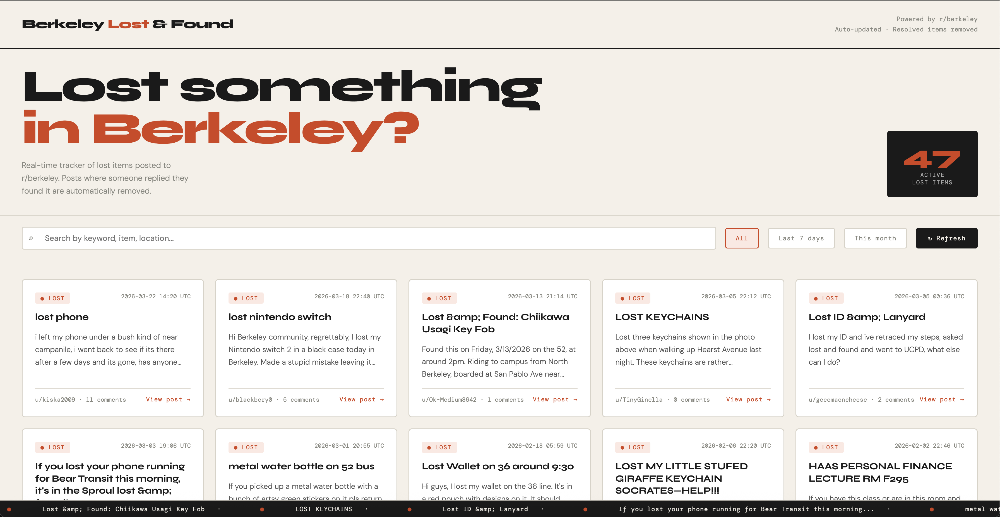
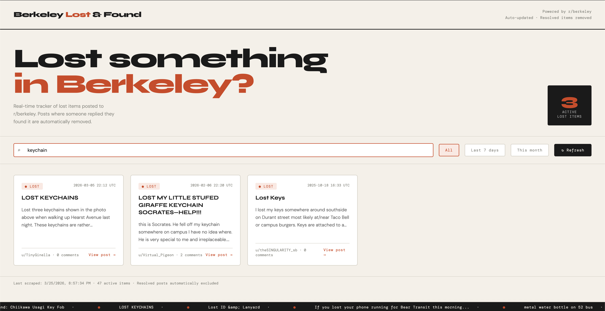

# Berkeley Lost & Found ⌕

A live web dashboard that automatically scrapes **r/berkeley** for lost item posts and removes any that have been resolved (i.e. a comment says the item was found/returned).

## Preview

<div align="center">
  
  
  <br/>
  <em>Dashboard view &nbsp;&nbsp;&nbsp;&nbsp;&nbsp;&nbsp;&nbsp;&nbsp;&nbsp;&nbsp;&nbsp;&nbsp; Search & filter</em>
</div>

## Live Demo
🔗 https://berk-lost-found.onrender.com/
> First load may take ~30 seconds because it'a on the free tier
> If it takes too long to load you can also run it locally with instructions below.

## Features
- Scrapes r/berkeley for lost item posts using Reddit's public JSON API
- Auto-filters resolved posts by scanning comments for "found" signals
- Search and filter by date
- Live scrolling ticker of active lost items
- One-click refresh button to re-scrape

## Tech Stack
- **Backend:** Python + Flask
- **Scraping:** requests + Reddit public JSON API
- **Frontend:** Vanilla HTML/CSS/JS
- **Deployment:** Render

## Run Locally

```bash
# Install dependencies
pip install -r requirements.txt

# Scrape Reddit data
python scraper.py

# Start the Flask server
python app.py
```

Then open `http://localhost:5000`

## Project Structure
```
berkeley-lost-found/
├── app.py              # Flask API + routes
├── scraper.py          # Reddit scraper with resolved-post filtering
├── berkeley_lost.json  # Scraped data (auto-generated)
├── requirements.txt    # Python dependencies
├── render.yaml         # Render deployment config
└── templates/
    └── index.html      # Frontend dashboard
```

## How the "found" detection works

After fetching each lost post, the scraper fetches its comments and checks for keywords like:
`"found it"`, `"returned"`, `"resolved"`, `"dm sent"`, `"already found"`, etc.

If any comment matches, the post is excluded from the dashboard.